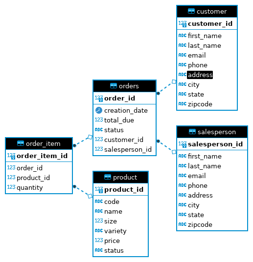

# Introduction
The Java Database Connectivity (JDBC) application is used to establish a connection to a PostgresSQL database. The application is designed for clients to perform predefined CRUD (create, read, update, delete) operations to the database. The application was written in Java and containerized using Docker. Maven was used to as a java tool to help streamline the build process.  
# Implementation

## ER Diagram

## Design Patterns
#### Data Access Object (DAO)
The Data Access Object pattern is a design pattern that provides isolation of the application(business layer) from the relational database (persistence layer). The DAO is usually implemented by using an abstract API. The DAO servers the purpose is to hide the application's complexities that comes with performing CRUD and other operations in the program. This allows the layers to be developed separately without acknowledging each other's process.
#### Repository
The Repository pattern consists of classes or components that encapsulate the operations used to access specific aspects of the database. This pattern is able to access one table per class and performing join operations in the java code rather than the database. The pattern also hides the data access functionalities such as CRUD, for easier maintainability. This allows the focus to be more on the data persistence logic rather than the data access plumbing. The DAO focuses on the abstraction of data persistence, while the Repository is an abstraction of a collection of objects. 
# Test
The application was tested using a database created with the use of SQL scripts. These scripts created tables and populated each table with sample data.  In order to test if the SQL statements ran successfully against the database, queries were preformed after any data inserted. The JDBCExecutor was used to run adn test the functionalities of the application. CRUD operations and join operations were tested by creating, reading, updating, and deleting data and printing to the terminal to see if the actual output matches the expected output. 