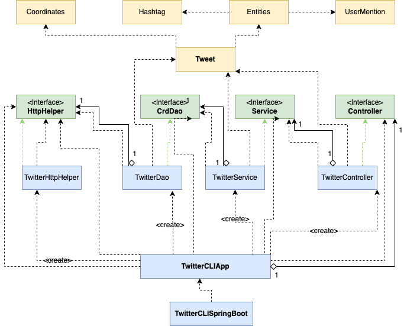
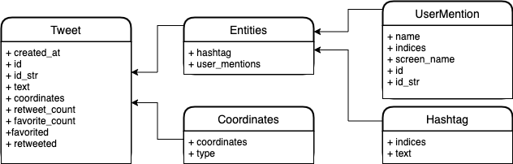

# Introduction
The twitter CRUD Application is a Java application that allows the user to post, retrieve, and delete Tweets on a Twitter Developer Account. This is accomplished using the official Twitter REST APIs. The application's design is based on the MVC architecture, consisting of a controller layer, service layer, data access object layer (DAO), and a model. The application is then tested using Junit, Mockito, and Integrated tests. The application was then packaed and dockerized and was uploaded as an image on the DockerHub. The technologies used in the application include:

- Java
- Maven
- Twitter REST APIs
- HTTP & JSON
- JUnit & Mockito
- Spring 
- Docker

# Quick Start
These environment variables must be exported and must be retrieved from a Twitter Developer App:
- **consumerKey**: API Key
- **consumerSecret**: API Secret
- **accessToken**: Access Token
- **tokenSecret**: Access Secret

#### Usage

**POST**
- Allows the user to post a tweet with a location using geotag
- `TwitterApp post tweet_text longitude:latitude`

**SHOW**
- Allows the user to retrieve and  read a tweet by using the tweet's id
- `TwitterApp show tweet_id [field1, field2,...]`

**DELETE**
- Allows the user to delete one or multiple tweets
- `TwitterApp delete [id1, id2 ...]` 

####Running the Program
A. Using Docker

1. `docker pull paulguevarra/twitter`

2. `docker run --rm \
   -e consumerKey=YOUR_KEY \
   -e consumerSecret=YOUR_KEY \
   -e accessToken=YOUR_TOKEN \
   -e tokenSecret=YOUR_TOKEN \
    paulguevarra/twitter post|show|delete [option]`

B. Using Maven

1. `mvn clean package`
2. `java -jar target/twitter-1.0-SNAPSHOT.jar post|show|delete [option]`
# Design

## UML Diagram

## Application
**TwitterCLIApp**

This is the component where the user interacts with in order to use the Twitter CRUD Application. It takes user input from the Linux CLI and calls the post, show, or delete methods in the Controller layer with respects to the CLI arguments. The application also retrieves the keys and tokens set in the system environment to be used.
## Controller Layer
**TwitterController**

This The controller layer retrieves and verify the CLI arguments set by the user to ensure the there is the correct amount of arguments and that they are all formatted correctly. The layer then calls the service layer to post, show, or delete.
## Service Layer
**TwitterService**

The service layer performs the business logic of the application. It ensures that the tweet text is no greater than 280 characters. The layer verifies that the tweet id is in the correct numerical format. It ensures that the latitude is in between -90 and 90, and the longitude is between -180 and 80.
## Data Access Object (DAO) Layer
**TwitterDao**

The DAO layer handles the HTTP requests and responses, and sends and retrieves information to and from the Twitter Website. This layer uses the TwitterHttpHelper and URI statements in order to execute `POST` and `GET` requests. 
## Models

### Tweet

The Twitter CRUD Application uses a simplified version of the complete Tweet Model. The simplified version excludes attributes that are not needed for the Application to run. The Tweet object consist of attributes, and other objects including Coordinates, Entities, Hashtag, and UserMention.

# Spring
The Spring framework was used in order to handle all the dependencies in the Twitter CRUD Application. Beans were implemented in the TwitterCLISpringBoot class and were indicated throughout the application using `@Component`, `@Repository`, `@Controller`, `@Service`. The TwitterCLIComponentScan class, a replication of the `@ComponentScan` Spring function, was used to scan the beans. 
# Test
The Twitter CRUD Application was tested using Integration and Unit testing from JUnit 4. The Integration tests require the dependencies to be correct and complete before testing, to confirm that the previous written programs are correct before testing the current program. Unit testing uses Mockito to create mock objects instead of using dependencies. This allows the testing of individual components during the development of that application, rather than relying on other previous written programs. 
## Deployment
The Twitter CRUD Application was deployed using Docker to the DockerHub. An image of the application was built using the docker command `docker build -t paulguevarra/twitter` and pushed by using `docker push paulguevarra/twitter`. The Docker image can be viewed using the command `docker pull paulguevarra/twitter` or on https://hub.docker.com/r/paulguevarra/twitter. 
## Improvements
1. Allow the application to post images or embedded links. 
2. Implement a feature that retrieves trending posts or hashtags. 
3. Implement a feature that can allows you to view your tweet before posting it. 
