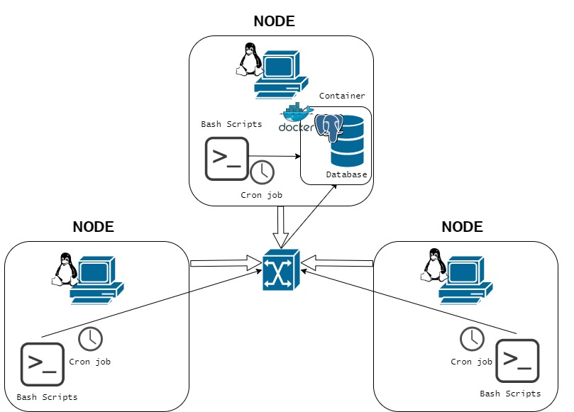

# Linux Cluster Monitoring Agent


##Introduction
This project, Linux Cluster Monitoring Agent (LCMA), was created as a tool for the LCA team to manage and monitor clusters of nodes/servers running CentOS. 7 (Linux). These nodes are connected through a switch that can communicate with one another using the node’s internal IPv4 address. The LCMA records each node’s hardware specifications and usage both statically and dynamically (real-time) using scripts. The data is then collected and stored into a RDBMS (Postgres Docker Database) managed by a node/server to analyze the data, check for hardware failures, and plan future resource management. A crontab was implemented in order add new data entry is added to the host usage table every minute. The database is then tested with SQL queries using the DBeaver application. The technologies used to build the LCMA includes:
-	Linux
-	CentOS
-	Docker
-	Postgres SQL
-	Bash
-	Git
-	Github
-	Google Cloud Platform
-	Crontab
-	DBeaver

## Quick Start
1. Create a docker container to store and run the database psql_docker.sh script.

```./scripts/psql_docker.sh create [db_username][db_password]```

3. Start the container using the psql_docker.sh script.

 ```./scripts/psql_docker.sh start [db_username][db_password]```

3. Run the psql instance using instance in order create and start the database container using the psql command.

```psql -h localhost -U postgres -W -d host_agent```

4. Create tables to store the hardware specifications and usage of the host node using ddl.sql. 

```psql -h localhost -U postgres -d host_agent -f sql/ddl.sql```

6. Insert the hardware specification data in the Database running the host_info.sh script. 

```./scripts/host_info.sh psql_host psql_port db_name psql_user psql_password```

7. Insert the hardware usage data into the Database running the host_usage.sh script.

```./scripts/host_usage.sh psql_host psql_port db_name psql_user psql_password```

8. Create the crontab by using this command.
  
```Crontab -e```

9. Once in the crontab editor, enter the following cron job. Run the crontab to monitor and update the host_usage table every minute.

```* * * * * bash ~/linux_sql/host_agent/scripts/host_usage.sh localhost 5432 host_agent postgres password > /tmp/host_usage.log```

10. To test the database with different queries, use queries.sql.

```psql -h localhost -U postgres -d host_agent -f sql/queries.sql```

## Implementation
In order to implement the LCMA, a docker container must be used in order to contain the PSQL database for the data to be stored. Each node contains a bash script that retrieves the hardware specification and usage data. A crontab was implemented to run the hardware usage script periodically on each node. A few queries were created in order to retrieve and test out the data from the database.

## Architecture


## Scripts
- ```psql_docker.sh```
    
This script creates, starts, or stop a docker container that contains the PSQL database.
    
 ```./scripts/psql_docker.sh create|start|stop [db_username][db_password] ```


- ```host_info.sh```

     This script gathers the information of the node's hardware specification including hostname, cpu_number, cpu_architecture, cpu_model, cpu_mhz, l2_cache, total_memory, and timestamp and inserts it into the PSQL database.
     
```./scripts/host_info.sh psql_host psql_port db_name psql_user psql_password ```


- ```host_usage.sh```
     
This script gathers the information of the node's hardware specification including timestamp, hostname, free_memory, cpu_idle, cpu_kernel, disk_io, and disk_available.
     
```./scripts/host_usage.sh psql_host psql_port db_name psql_user psql_password ```


- ```ddl.sql```
     
This SQL file creates the host_info and host_usage table in the host_agent PSQL database.

```psql -h localhost -U postgres -d host_agent -f sql/ddl.sql```

- ```Crontab```
     
This Cron job runs the host_usage.sh script in order to gather the hardware usage data every minute and insert it into the database.


- ```queries.sql```

This SQL file queries the data, which is used for analyzing the data, including:
 - List of hosts and their total memory size grouped by CPU
 - List the average amount of memory used by each host in 5-minute intervals
 - Detect host failures in the localhost (Linux CentOS 7 VM)


```psql -h localhost -U postgres -d host_agent -f sql/queries.sql```

## Database Modeling
The host_agent database consists of two tables, host_info and host_usage. The host_info table stores the hardware specifications and the host_usage table contains the hardware usage data.

- host_info TABLE

| Attributes       | Data Type | Constraints     | Description                                                |
|------------------|-----------|-----------------|------------------------------------------------------------|
| id               | SERIAL    | PRIMARY KEY     | Auto-increment to differentiate the data in PSQL Database  |
| hostname         | VARACHAR  | NOT NULL UNIQUE | Host node name                                             |
| cpu_number       | INTEGER   | NOT NULL        | Number of CPUs on the host node                            |
| cpu_architecture | VARACHAR  | NOT NULL        | The CPU architecture                                       |
| cpu_model        | VARACHAR  | NOT NULL        | The CPU processor                                          |
| cpu_mhz          | INTEGER   | NOT NULL        | CPU speed (MHz)                                            |
| L2_cache         | INTEGER   | NOT NULL        | L2 cache size (kB)                                         |
| total_mem        | INTEGER   | NOT NULL        | The node's total memory(kB)                                |
| timestamp        | TIMESTAMP | NOT NULL        | Time of data entry                                         |
- host_usage TABLE

| Attributes     | Data Type | Constraints     | Description                        |
|----------------|-----------|-----------------|------------------------------------|
| timestamp      | TIMESTAMP | NOT NULL        | Time of data entry                 |
| host_id        | SERIAL    | FOREIGN KEY     | References id from host_info Table |
| memory_free    | INTEGER   | NOT NULL UNIQUE | Total node's unused memory (mB)    |
| cpu_idle       | INTEGER   | NOT NULL        | CPU processor idle time (%)        |
| cpu_kernel     | INTEGER   | NOT NULL        | CPU kernel run time (%)            |
| disk_io        | INTEGER   | NOT NULL        | Number of disk I/O                 |
| disk_available | INTEGER   | NOT NULL        | Total available disk space (mB)    |

## Test
The LCMA was tested on CentOS Virtual Machine on the Google Cloud Platform using an SSH connection. The scripts were tested with both invalid number of arguments and the with necessary number of arguments on the command line. The data was observed using an SQL Client Software Application, DBeaver, and tested using multiple SQL queries. The results of the tests were as expected.

## Deployment
The LCMA used Docker as a container to manage the Postgres database instance and the crontab in order to execute the script periodically. The source code was managed using git and was pushed to GitHub using the GitFlow model, developing several feature branches.

## Improvements
- Write more queries to test and analyze the data for more failures and resource planning
- Implements a feature that handles hardware specification changes and update the host_info table with the new data
- Remove unnecessary or unused data (remove nodes and data not in use)
- Create a GUI to retrieve and query the data
